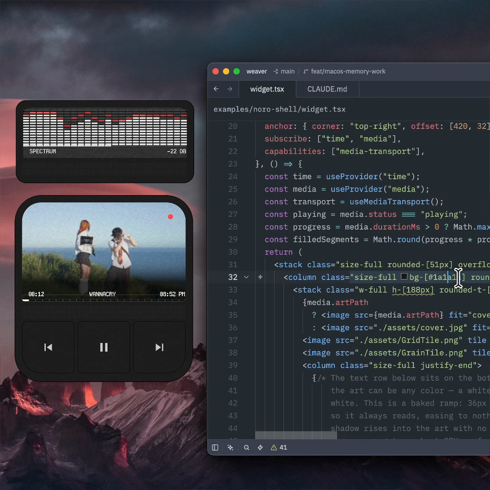

# Weaver

**Conjure. Share. Remix.** — desktop widgets built by prompting your agent,
shared as source, remixed by anyone's agent.

Weaver is an agent-native, cross-platform desktop widget platform (think
Rainmeter, rebuilt for 2026). A Widget is a TypeScript component rendered by a
Zig/QuickJS runtime through Weaver's fork of Vercel Labs' Native SDK — no
browser and no webview. Widgets are crash-isolated, GPU-rendered where that is
the measured winner, and presented with per-pixel transparency on the desktop
layer.

```tsx
import { useProvider, widget } from "@weaver/sdk";

export default widget({
  name: "Clock",
  size: [240, 110],
  anchor: { corner: "top-right", offset: [24, 24] },
  subscribe: ["time"],
}, () => {
  const time = useProvider("time");
  return (
    <column class="p-4 gap-1 bg-[#11141c]/86 rounded-2xl">
      <row class="items-baseline gap-2">
        <text class="text-3xl font-light">{time.hh}:{time.mm}</text>
        <text class="text-sm opacity-70">{time.ss}</text>
      </row>
      <text class="text-xs opacity-60">{time.weekday}, {time.month} {time.day}</text>
    </column>
  );
});
```

That file is a complete widget. It is also the *distribution format*: a
shared Weaver widget is always its source — what you read is what runs, and
every install is a potential remix.



## Why Weaver is different

- **Prompt-to-desktop authoring.** TSX, familiar hooks, and Tailwind-like
  classes give coding agents a surface they already know. `weaver check`
  returns errors intended to be actionable without reading Weaver's code.
- **Native pixels without a browser tax.** A small Zig runtime embeds QuickJS
  and projects retained operations into a native renderer instead of shipping
  Chromium with every Widget.
- **Source is the artifact.** A deterministic `.weave` contains readable
  source, assets, declared access, provenance, and remix lineage — never an
  opaque executable.
- **Isolation without duplicated collection.** Widgets fail independently;
  expensive system data is collected once by the host, fanned out only to
  subscribers, and reported unavailable instead of fabricated.
- **Performance has receipts.** CPU, physical footprint, wakeups, frame
  cadence, and multi-Widget cost are product gates. Limits are measured
  tripwires with named diagnostics, not silent guesses.

## Status: v0 (pre-alpha), Windows + macOS developer builds

The authoring and source-sharing paths work end to end on Windows and macOS:
scaffold → agent edits the TSX → `weaver check` (agent-readable errors) →
`weaver dev` → live widget. The portable `init` / `check` / `bundle` / `pack` /
`inspect` / `install` / `uninstall` / `logs` lifecycle uses the same `.weave`
bytes and install-owned source boundary on both platforms. macOS now has its
native supervisor, acknowledged lifecycle, crash/backoff recovery, process
cost status, state-preserving dev hot swap, a host-owned shared renderer, and
host-owned providers from the stacked
[Lane D implementation plan](docs/macos-port-brief.md). See the honest milestone
notes in [`docs/m0-results.md`](docs/m0-results.md) and
[`docs/m1-results.md`](docs/m1-results.md), plus the portable artifact evidence
in [`docs/weave-results.md`](docs/weave-results.md). Expect everything to
change.

Host-owned CPU, memory, and audio providers now run on both platforms and stay
off with no subscriber. macOS audio uses one public Core Audio process tap and
one shared analysis/fan-out pipeline; unavailable permission or hardware is
reported explicitly and never replaced with fake frames. Media metadata,
artwork, transport controls, and seek work on Windows and on macOS 15.4+.
macOS uses a supervised, isolated MediaRemote adapter because public APIs do
not expose the system-wide session; that choice is suitable for direct
distribution, not the Mac App Store, and remains honest-unavailable on older
macOS versions or adapter failure. See
[`ADR 0017`](docs/adr/0017-macos-mediaremote-adapter.md) and the attended
[`media v2 results`](docs/media-v2-results.md).

The engine is ahead of the product shell. There is not yet an end-user
manager, loud capability-consent flow, `weaver remix` command, signed
installer/updater, or public gallery. Only noro-player has cleared the full
beta skin-parity bar. Those are the roadmap, not footnotes; see
[`docs/ROADMAP.md`](docs/ROADMAP.md) for the current sequence.

## Sponsors

Weaver's open-source development is supported by:

<a href="https://www.greptile.com/?utm_source=oss_badge&utm_medium=readme&utm_campaign=greptile_for_open_source">
  
</a>

[Greptile's Open Source Program](https://www.greptile.com/open-source) provides AI code review for the project.

**[OpenAI — Codex for Open Source](https://openai.com/form/codex-for-oss/)** provides tooling and credits for open-source maintenance.

## Quickstart

Prerequisites: Windows 11 or macOS 14.2+, [Node 22+](https://nodejs.org), and
[Zig 0.16.0](https://ziglang.org/download/) on PATH. Clone the reviewed Native
SDK fork commit with the repository:

```sh
git clone --recurse-submodules https://github.com/SunkenInTime/weaver
cd weaver
npm ci
```

On macOS:

```sh
(cd runtime && zig build -Doptimize=ReleaseFast)
(cd host && zig build -Doptimize=ReleaseFast)

node cli/bin/weaver.js init myclock
node cli/bin/weaver.js check myclock
node cli/bin/weaver.js dev myclock
```

On Windows PowerShell:

```powershell
Push-Location runtime
zig build -Doptimize=ReleaseFast -Dweb-layer=exclude -Dtrace=off
Pop-Location
Push-Location host
zig build -Doptimize=ReleaseFast
Pop-Location

node cli\bin\weaver.js init myclock
node cli\bin\weaver.js check myclock
node cli\bin\weaver.js dev myclock
```

Stop `dev` with Ctrl-C. The portable artifact loop is the same on both systems:

```sh
node cli/bin/weaver.js pack myclock
node cli/bin/weaver.js inspect myclock.weave
node cli/bin/weaver.js install myclock.weave
node cli/bin/weaver.js uninstall Myclock
```

On Windows, use backslashes in the CLI path. Before running an audio-reactive
Widget on macOS, authorize the signed host identity in the foreground:

```sh
node cli/bin/weaver.js audio authorize
```

### macOS diagnostics and permission reset

```sh
node cli/bin/weaver.js status --json
node cli/bin/weaver.js logs "Clock"
node cli/bin/weaver.js logs "Clock" --follow
codesign --verify --deep --strict host/zig-out/Weaverd.app
plutil -p host/zig-out/Weaverd.app/Contents/Info.plist
```

To discard every privacy decision associated with the development host bundle,
stop it, reset that one bundle identity, rebuild, and authorize again:

```sh
node cli/bin/weaver.js down
tccutil reset All com.sunkenintime.weaver.host
(cd host && zig build -Doptimize=ReleaseFast)
node cli/bin/weaver.js audio authorize
```

`tccutil reset All` is intentionally bundle-scoped but broader than audio: it
removes every saved privacy choice for that host ID. Diagnostics never require
disabling SIP, Gatekeeper, the firewall, or any global security control.

### Development support matrix

| Target | Automated gate | Physical status |
|---|---|---|
| Windows 11 x64 | Build, runtime/host/unit, portable artifact and example surfaces | Existing production/reference platform |
| macOS 14.2+ Apple silicon | Clean build, headless suites, real AppKit Widget/session/provider/crash/teardown gate | M2 MacBook Air measured and visually exercised |
| macOS 14.2+ Intel | Build, runtime/host/unit, portable artifact and nonvisual daemon lifecycle | Physical Intel hardware unverified |
| Linux | None | Unsupported |

The current distribution is a source checkout and ad-hoc-signed developer host,
not a notarized installer, login item, App Store product, or universal package.
The remaining physical limits are explicit: external-display arrangements,
Stage Manager/Space/fullscreen/lock and sleep/wake coverage, post-grant System
Audio revocation and physical route recovery, Bluetooth/AirPlay, and Developer
ID notarization are not inferred from automation. OS screen capture, Show
Desktop, and integrated-output System Audio capture now have physical evidence.
The macOS MediaRemote route still needs exact-floor testing at 15.4 and a
shipping signed/notarized bundle gate.
See [`macos-m12-results.md`](docs/macos-m12-results.md) and the live
[`macos-run-status.md`](docs/macos-run-status.md) for the exact gates and
blockers.

Or do it the intended way: point your coding agent at
[`skills/conjure-widget/SKILL.md`](skills/conjure-widget/SKILL.md) and ask it
for the widget you actually want.

## How it's put together

| Path | What |
|---|---|
| `runtime/` | `weaver-widget[.exe]` — Zig, embeds QuickJS-NG, renders via the Native SDK fork (submodule `runtime/native-sdk`) |
| `sdk/` | `@weaver/sdk` — the authoring API: reconciler, hooks, class compiler. Contract frozen in [`sdk/CONTRACT.md`](sdk/CONTRACT.md) |
| `cli/` | `weaver` — init / check / bundle / dev / pack / inspect / install / uninstall / logs |
| `skills/` | agent skills (conjuring is the primary authoring path) |
| `docs/adr/` | why things are the way they are — start here to understand the project |
| `CONTEXT.md` | the domain glossary |

The substrate is a fork of
[vercel-labs/native](https://github.com/vercel-labs/native)
([our fork](https://github.com/SunkenInTime/native), branch `weaver-main`)
adding Weaver-owned desktop-widget windowing, capacity, and presentation
semantics. The general static-TLS problem discovered while profiling the fork
was reported as [vercel-labs/native#114](https://github.com/vercel-labs/native/issues/114)
and fixed upstream separately; the Weaver product surface remains in the fork.

## License

Weaver is licensed under the [Apache License 2.0](LICENSE).
Third-party and vendored components remain subject to their respective licenses.
