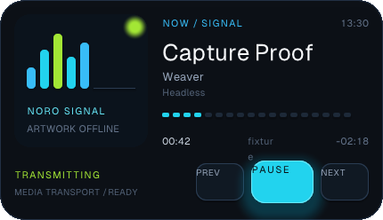
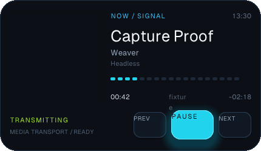
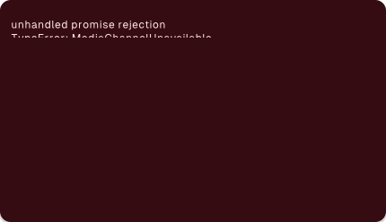

# Noro Signal capture evaluation

This is a dogfood pass for `weaver capture`: build a materially different
version of the Noro media player, inspect its fixed-input pixels and semantic
tree, and then drive its controls through the capture action protocol. The
original [`examples/noro-shell`](../examples/noro-shell) remains visually
unchanged. The alternative lives in
[`examples/noro-signal`](../examples/noro-signal).

## Outcome

The alternative design works for deterministic visual and semantic capture.
It is a 430 x 248 signal-console layout using the same `time`, `media`, and
`media-transport` contracts as Noro. With the fixed clock and the recorded
media provider frame, `weaver check` passes and capture publishes the expected
track, time, progress, state, and PREV / PAUSE / NEXT controls.



The working receipt reported:

- status `ok`, 430 x 248 pixels, and no warnings;
- 118 draw commands and 65 semantic nodes;
- 106,200 pixels different from the transparent clear color;
- no pending providers, images, or frame requests.

Reproduce it with:

```sh
node cli/bin/weaver.js check examples/noro-signal
node cli/bin/weaver.js capture examples/noro-signal \
  --clock 2026-08-24T17:30:00.000Z \
  --provider-fixture test/capture/noro.provider.json \
  --out /tmp/noro-signal.png
```

The pass found and closed two framework breaks and one semantic authoring gap.

## Solved: a shadow turned a content stack into a leaf

The first design put `shadow-inner` on the 150 x 150 artwork `<stack>`. Capture
still returned `status: "ok"`, 87 draw commands, 63 semantic nodes, no warning,
and the same total non-clear pixel count, but the entire artwork subtree was
missing from the image:



The semantic snapshot retained the artwork stack and all its children with
correct bounds. Removing only `shadow-inner` restored every child. This is not
a clipping or reference-rasterizer problem:

1. [`sdk/src/class-compiler.ts`](../sdk/src/class-compiler.ts) compiles
   `shadow-inner` into an inset box-shadow.
2. `attachEffects` in [`runtime/src/main.zig`](../runtime/src/main.zig) places
   that shadow in `Widget.immediate_commands`.
3. Both stack branches in
   [`widget_render.zig`](../runtime/native-sdk/src/primitives/canvas/widget_render.zig)
   call `emitImmediateCanvas` and then skip or return before emitting children
   whenever a stack has any immediate command.

That means every `shadow-*` utility can erase the children of a TSX `<stack>`;
`overflow-hidden` only made the initial symptom look like bad compositing.

Implemented framework fix:

- A styled TSX stack projects as a painted panel containing an unstyled stack,
  matching the existing styled row and column projection in `buildNode`. The
  panel owns background, border, radius, and shadow; the inner stack keeps
  overlay layout. This also gives inset shadows an explicit paint order.
- Retained-tree and lowered-budget regressions cover a shadowed stack with
  overlapping children and assert that the shadow, fill, border, and every
  child command are present, including the `shadow-inner` plus rounded clip
  case.
- Noro Signal now uses its original `shadow-inner`; capture retains the artwork
  subtree and reports 31 more draw commands than the failure receipt.

A total non-clear-pixel count cannot catch this class of partial blanking, so a
focused renderer regression is the useful tripwire; raising a global pixel
minimum is not.

## Solved: media actions published a successful error screen

The semantic driver resolves the PAUSE button correctly. The reproduction file
is [`test/capture/noro-signal.actions`](../test/capture/noro-signal.actions):

```sh
node cli/bin/weaver.js capture examples/noro-signal \
  --clock 2026-08-24T17:30:00.000Z \
  --provider-fixture test/capture/noro-action.provider.json \
  --action-file test/capture/noro-signal.actions \
  --out /tmp/noro-signal-action.png
```

After the click, the media command rejects with `MediaChannelUnavailable` and
the widget is replaced by its unhandled-promise error panel. This screenshot is
the original false-success artifact retained as the regression receipt:



The original provider fixture marked the provider client connected so hooks
could receive recorded frames, but it opened no socket or pipe. A media command
then reached `send`, found no live transport, and rejected. Before capture
health validation landed, the receipt still said `status: "ok"` and published
the error screen as a valid result; the post-action tree had dropped from 63
nodes and 112 commands to 3 nodes and 6 commands.

The fixture now has an ordered `commands` array. Each entry names the expected
verb, the exact `seekMs` for seek, and the acknowledgement `ok` outcome. A
match queues the acknowledgement through the ordinary provider lane, wakes the
app loop, and resolves the SDK promise before capture validation. The successful
Noro action receipt reports:

- `interactions.actions: ["click"]`;
- `interactions.mediaCommands: [{ verb: "pause", ok: true }]`;
- two driven frames and zero pending frame requests;
- the intact 65-node, 118-command Noro surface rather than an error panel.

Unexpected, mismatched, and missing command expectations fail as
`CaptureMediaCommandUnexpected`, `CaptureMediaCommandMismatch`, and
`CaptureMediaCommandMissing`, respectively. Each produces only an error receipt
and no publishable image or snapshot. Capture drains the app-level frame
requests present at each action boundary before the coalesced GPU frame, while
requests created during that turn remain visible instead of permitting an
animated widget to spin capture forever.

## Solved: the seek overlay has an accessible name

The seek overlay is a transparent button with no text child. It now declares
`accessibilityLabel="Seek"`, and the snapshot reports
`role=button name="Seek"` so an agent can identify the control without pixels.

Implemented framework fix:

- `accessibilityLabel` is available on buttons and sliders and projects ahead
  of descendant-text fallback. It reuses the measured authored-text storage,
  so the retained `Node` size does not grow.
- `weaver check` rejects controls it can prove unnamed and gives the concrete
  visible-text or `accessibilityLabel` fix. Dynamic/component output remains a
  runtime decision instead of producing a static false positive.

## Solved: queued frame request at capture completion

The initial dogfood receipt exposed one queued app-level frame request after a
static capture. Native capture now settles the requests already present at the
startup and action boundaries. Both static and action-driven Noro Signal
captures finish with `pending.frameRequests: 0` without an arbitrary loop cap.
